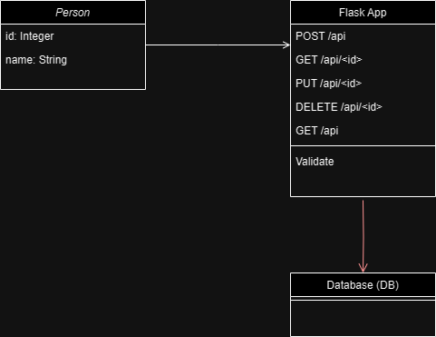

# Simple Flask Rest Api

A simple Flask REST API capable of CRUD operations on a "person" resource, interfacing with a database.

# Database Modelling Diagram

UML (Unified Modeling Language) diagram that represents the structure and relationships of the API classes and models.

# Components of the Project

## Person Class

This is the main class in the application. It has two attributes: `id` and `name`.

## Flask App

This is the main application object. It doesn’t have any attributes in the current design, but it has methods corresponding to each of the API endpoints: `create_person`, `read_person`, `update_person`, `delete_person`, and `get_all_persons`.

## Database (db)

This is the SQLAlchemy database instance. It doesn’t have any attributes or methods in the current design, but it’s used to interact with the Person class.

# Text Representation of UML Diagram

## Person

- `id`: Integer
- `name`: String

## Flask App

- `create_person()`: POST /api
- `read_person(id)`: GET /api/<id>
- `update_person(id)`: PUT /api/<id>
- `delete_person(id)`: DELETE /api/<id>
- `get_all_persons()`: GET /api

## Database (db)

## UML diagram Sketch

```
      +---------------+            +---------------+
      |   Flask App   |<>--------->|    Person     |
      +---------------+            +---------------+
                                    | - id: Integer |
                                    | - name: String|
                                    +---------------+
                                                |
                                                |
                                                |
                                    +---------------+
                                    |  Database (db)|
                                    +---------------+
```

## UML diagram




